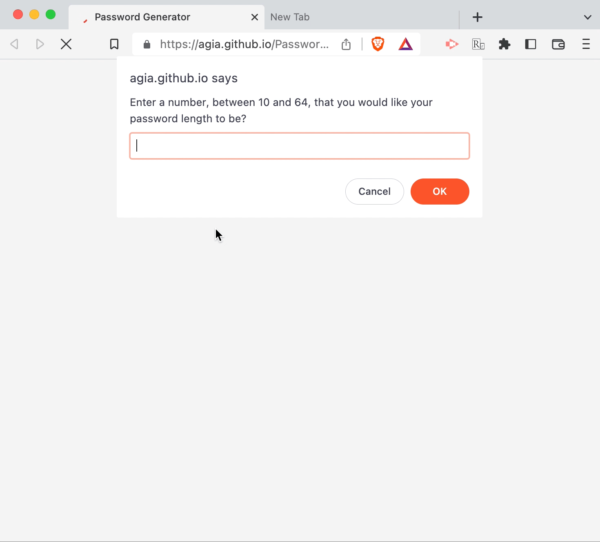

# Password Generator

## Description

[**View demo**](https://agia.github.io/Password-Generator/)

A browser-based password generator, that prompts the user for choices, and outputs a randomized password based on those choices.

Built using vanilla JavaScript, HTML and CSS.

## Usage

 The live demo is hosted with Github Pages, and can be accessed by clicking [**here**](https://agia.github.io/Password-Generator/) (or the `View Demo` link found in the section above).

## Credits

Thanks directed, in perpetuity (at least in technology terms), to the documentation found on [MDN Docs](https://developer.mozilla.org/en-US/docs/Web/javascript), which were incredibly helpful.

## Future Development

I would like to like to revisit this project in the future, with a mind to overhauling the design (I'll take any opportunity to stretch and improve those CSS, HTML and user experience / design muscles), and further honing in on validating the user input (using `typeof`, for example, to ensure user input is a number where expected).

Since they were out of the scope for the assignment, I didn't want to over-complicate my initial submission. But I fully intend to revisit this project and use it as a practice exercise in future to improve my skills.